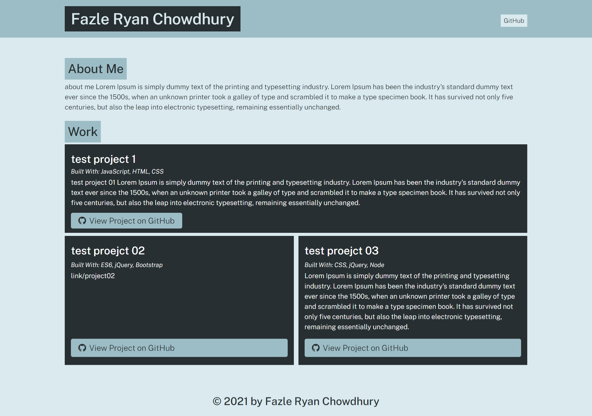

# portfolio-generator

## Screenshot:

## use Node.js to build a program that creates an HTML portfolio page

- Usage of the command line to capture user input and place it in a JavaScript function that provides the finished HTML page as output.

## Following is performed for the project:
- Use the fs module to copy files from one location to another.
- Created JavaScript Promises to handle asynchronous functionality.
- Concatenated variable data into strings using template literals along with some other new ES6 features such as destructuring and spread/rest operators.
- Modularized the Node.js applications to enhance code readability and reusability.
- Used Inquirer libraries for input.
- Used new features brought about by the JavaScript ES6 specification.